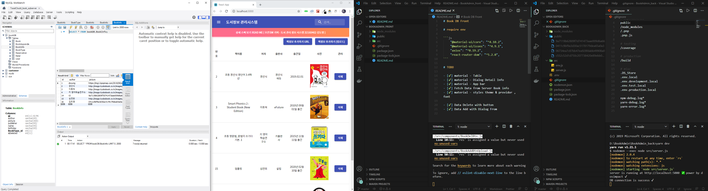
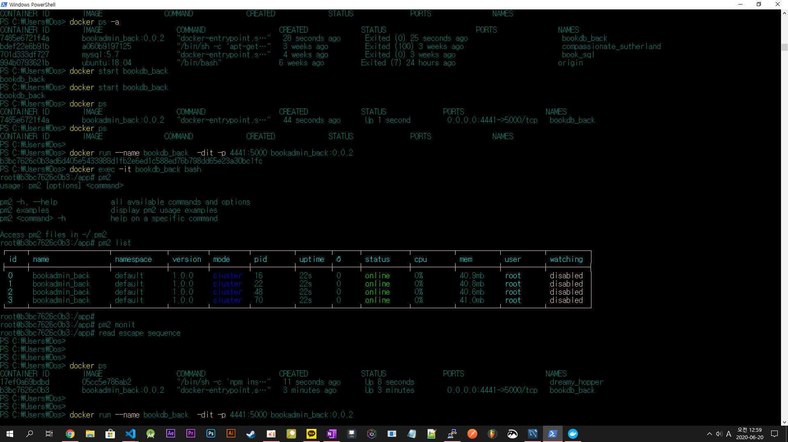

# BOOK DB Backend




# required env

```
  "dependencies": {
    "body-parser": "^1.19.0",
    "cors": "^2.8.5",
    "express": "^4.17.1",
    "multer": "^1.4.2",
    "mysql": "^2.18.1"
  },
  "devDependencies": {
    "nodemon": "^2.0.4"
  }
```

# Docker Devops

- STEP1 .dockerignore

```
node_modules
public.dockerignore
Dockerfile
Dockerfile.prod
```

- STEP2 DockerFile

```js
FROM node:carbon

RUN mkdir -p /app
WORKDIR /app
ADD ./ /app


RUN npm install
RUN npm install pm2 -g
ENV NODE_ENV=production

EXPOSE 5000
#CMD pm2 start ./src/server.js -i max
CMD ["pm2-runtime", "ecosystem.config.js"]
```

- STEP3
- run cmd : pm2 ecosystem
- and get a file named "ecosystem.config.js"
- make your env , cluster mode , etc...

```js
module.exports = {
  apps: [
    {
      script: "./src/server.js",
      name: "bookadmin_back",
      exec_mode: "cluster",
      instances: 4,
    },
  ],

  deploy: {
    production: {
      user: "SSH_USERNAME",
      host: "SSH_HOSTMACHINE",
      ref: "origin/master",
      repo: "GIT_REPOSITORY",
      path: "DESTINATION_PATH",
      "pre-deploy-local": "",
      "post-deploy":
        "npm install && pm2 reload ecosystem.config.js --env production",
      "pre-setup": "",
    },
  },
};
```

- STEP4 build docker file

```
D:\BookAdmin\BookAdmin_back>docker build -t bookadmin_back:0.0.2 .
```

- STEP5 execution docker image

```
docker run --name bookdb_back -itd -p 4441:5000 bookadmin_back:0.0.2

```

- STEP6 check container and monit

```
docker run --name bookdb_back -itd -p 4441:5000 bookadmin_back:0.0.2
docker attach -it bookdb_back bash
pm2 monit
```
